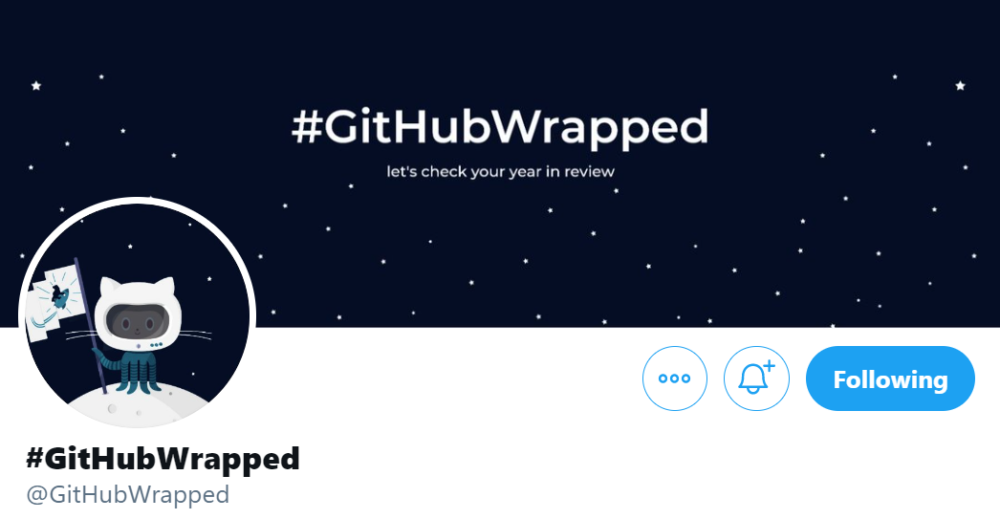

<p align="center">
    
    <br/>
<a  href="https://githubwrapped.tech/">Generate your report</a>
</p>
<hr>

#### Why do I exist?
### 2020 has been a challenging year for all of us.

As the year is ending, we thought to take a look back at all the contributions **you** as an individual
made to the open-source community, during these unprecedented times.

Also, since Spotify, Snapchat and other mass platforms have their own way of year wrap up, **why not us?** 

<center><pre><a href="https://githubwrapped.tech">githubwrapped.tech</a></pre></center>

<hr>

### Reports

This web app deployed at [githubwrapped.tech](https://githubwrapped.tech) will help you to generate yearly reports that contains your stats from the beginning of this year.

Including number of commits, stars etc.


You can also save your report as an image using the 'Save Report' button and share it with the community or keep it as a memorandum :)

<hr>

#### Project Structure


This project uses [React.Js](https://reactjs.org) and the contents are bundled using webpack.

The contents in this project follow the following structure.

```
├───api
├───public
│   └───assets
└───src
    ├───components
    ├───constants
    ├───containers
    └───helpers
```

Each individual component and container, follows this structure
```
section
  ├──index.jsx (main entry point)
  └──style.scss
```

### Tweet Bot

The celebrations doesn't end here! We also our own cute octo-bot on twitter [@GitHubWrapped](https://twitter.com/GitHubWrapped).

<p align="center">

</p>

Octobot stays awake all day/night to like & retweet all your tweets that use the hashtag #GitHubWrapped.

## Setup

##### Clone the repository

```bash
git clone https://github.com/ishandeveloper/github-wrapped.git
```

##### Move to the desired folder

```bash
cd \github-wrapped
```

##### To install the dependencies, simply write

```bash
yarn install
```

##### To run the app, simply write

```bash
yarn start
```

[](https://github.com/ishandeveloper)
